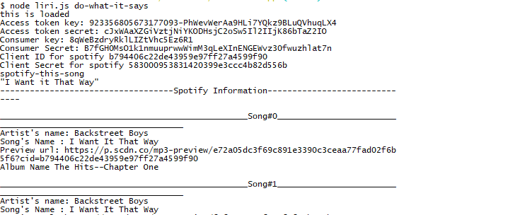

# liri-node-app

This is a pure javascript application which uses few apis to gather the data and display it to the user.
APIs used are 

  * twitter api
  * omdb movie api
  * spotify
  
The application also makes use of read file npm module to read file data dynamically and then display the requested information to the user based on the response received from various apis.

# Functionality
Below is the example command to run this node application and save the result to a log file.

	* node liri.js do-what-it-says 

